# Projektantrag und Projektdokumentation: RelaxSpot

**Modul**: 223 - Multiuser-Applikation
**Autor**: Yoshi Gyger
**Datum**: 25.09.2026
**Schulklasse**: INA24C

## 1. Einleitung

RelaxSpot ist eine Multiuser-Applikation, die Menschen dabei unterstützt, öffentliche Erholungs- und Ruheorte in ihrer Umgebung schnell zu finden, ihren Status einzusehen und bei begrenzter Kapazität eine Anwesenheit zu registrieren. Das Ziel ist es, kurze Pausen effizient und ohne unnötige Wartezeit oder Fehlwege zu gestalten.

Die Dokumentation beschreibt die Problemstellung, die Vision, die fachlichen Anforderungen, die Rollen und Berechtigungen, das Datenmodell, den aktuellen Umsetzungsstand sowie die Prüfung der Anforderungen. Sie bildet damit sowohl die Grundlage des Projektantrags als auch den aktuellen Stand der Umsetzung ab.

## 2. Problemstellung

In Pausen im Alltag oder im öffentlichen Raum fehlt vielen Personen oft ein verlässlicher Überblick über passende Ruhe- oder Entspannungsorte. Häufig ist nicht klar, ob ein Ort gerade frei, voll, ausgelastet oder in einem guten Zustand ist. Besonders in kurzen Pausen kann der Zeitverlust durch falsche Wegentscheidungen oder ungeplante Wartezeiten spürbar werden.

Ein praktisches Beispiel ist ein Arbeitnehmer, der in der Mittagspause schnell eine ruhige, schattige oder geräuscharme Stelle sucht. Er möchte in kurzer Zeit feststellen, wo er sich kurz ausruhen kann, ohne einen voll besetzten Ort zu besuchen. Das gleiche Problem betrifft Lernende, Pendler und Besucher von Innenstädten. Die bisherige Informationslage ist häufig unvollständig, veraltet oder auf einzelne Bereiche beschränkt.

Zusätzlich ist bei vielen öffentlichen Orten die Kapazität begrenzt. Eine kleine Bank, ein Ruheraum oder eine Raucherkabine kann nur eine feste Anzahl Personen gleichzeitig aufnehmen. Ohne zentrale, aktuelle Informationen entstehen unnötige Wege und Frustration.

## 3. Projektbeschreibung

### 3.1 Domäne

Community-basiertes Verzeichnis für öffentliche Erholungs- und Pausenorte mit Kapazitätsverwaltung.

### 3.2 Name der Applikation

RelaxSpot

### 3.3 Vision

RelaxSpot soll Menschen dabei helfen, in ihrer Umgebung schnell geeignete Orte zum Entspannen, Ausruhen oder kurzzeitigem Verweilen zu finden. Dabei sollen die Verfügbarkeit, der Status und die Kapazität eines Ortes transparent sichtbar sein. Die Community kann neue Orte vorschlagen, bestehende Informationen aktualisieren und Moderatoren bei der Freigabe und Pflege unterstützen.

### 3.4 Projektplanung: erste MVP-Iteration

Die erste Iteration fokussiert sich auf die zentrale Fachregel der Anwendung: Ein Nutzer meldet sich an einem Ort an und gibt seine voraussichtliche Aufenthaltsdauer an. Dabei wird die Kapazität geprüft. Wenn kein Platz mehr frei ist, wird die Anmeldung abgelehnt. Es handelt sich dabei nicht um eine Reservierung für die Zukunft, sondern um eine echte Anwesenheitsmeldung mit aktivem Zeitfenster.

Wichtige Multiuser-Aspekte in dieser Iteration sind:

- gleichzeitige Anmeldungen für denselben Ort müssen konsistent und ohne Overbooking behandelt werden
- Rollen und Berechtigungen müssen für Nutzer, Moderatoren und Admins korrekt geprüft werden
- Bearbeitungen von Orten durch Moderatoren müssen mit einem Edit-Lock geschützt werden

## 4. Anforderungen

### 4.1 Funktionale Anforderungen (priorisiert)

1. Nutzer können sich registrieren und einloggen.
2. Nutzer können Orte nach Kategorie und Standort suchen und filtern.
3. Nutzer können sich an einem Ort anmelden und dort ihre voraussichtliche Aufenthaltsdauer angeben.
4. Nutzer können neue Orte vorschlagen, die zunächst nur nach Freigabe sichtbar werden.
5. Nutzer können Statusmeldungen zu Orten erfassen, zum Beispiel „besetzt“, „geschlossen“ oder „verschmutzt“.
6. Moderatoren können Vorschläge prüfen und freigeben bzw. ablehnen.
7. Moderatoren können Ortsdetails anpassen und dabei den Bearbeitungslock beachten.
8. Admins können Moderatorenrechte vergeben und Nutzerkonten sperren.

### 4.2 Qualitätsattribute (priorisiert)

| Priorität | Qualitätsmerkmal | Beschreibung |
|---|---|---|
| 1 | Datenkonsistenz | Bei gleichzeitigen Check-ins darf die Kapazität nicht überschritten werden. |
| 2 | Performance | Suchen und Filtern müssen mit einer realistischen Anzahl an Orten schnell reagieren. |
| 3 | Zugriffsrechte | Nur berechtigte Rollen dürfen bestimmte Aktionen ausführen. |
| 4 | Aktualität | Statusmeldungen und Gegebenheiten müssen für andere Nutzer zeitnah sichtbar sein. |
| 5 | Verständlichkeit | Fehlermeldungen und Benutzersonly müssen klar und unmittelbar nutzbar sein. |

### 4.3 Rollen und Berechtigungen

| Rolle | Rechte |
|---|---|
| Nutzer | Orte ansehen, suchen, anmelden, Vorschläge einreichen, Status melden |
| Moderator | Alle Nutzerrechte plus Freigabe/Prüfung von Vorschlägen und Bearbeitung von Orten |
| Admin | Alle Moderatorrechte plus Rollenverwaltung und Nutzer-Sperrungen |

## 5. Locking und Transaktionen

### 5.1 Kapazitätskonflikt

Die zentrale fachliche Regel von RelaxSpot ist der Check-in an einem Ort mit Kapazitätsprüfung. Ein Ort hat eine begrenzte Anzahl freier Plätze. Wenn mehrere Nutzer gleichzeitig eine Anmeldung vornehmen, muss die Prüflogik atomar erfolgen. Dafür wird ein Transaktionskonzept mit pessimistischer Sperrung verwendet, damit nicht zwei parallele Vorgänge dieselbe Restkapazität gleichzeitig lesen und beide bestätigen.

Dadurch wird verhindert, dass die letzte freie Kapazität fälschlich mehrfach verwendet wird. Bei Überschreitung wird der zweite Vorgang abgelehnt.

### 5.2 Edit-Lock

Wenn ein Moderator einen Ort bearbeitet, wird für diesen Ort ein Lock gesetzt. Ein zweiter Bearbeitungsversuch durch eine andere Person wird verweigert. Dadurch werden inkonsistente Änderungen an denselben Ort vermieden. Der Lock wird beim Speichern, beim Abbrechen oder nach einem Timeout wieder freigegeben.

## 6. Datenmodell und ERM

### 6.1 Entity-Relationship-Modell

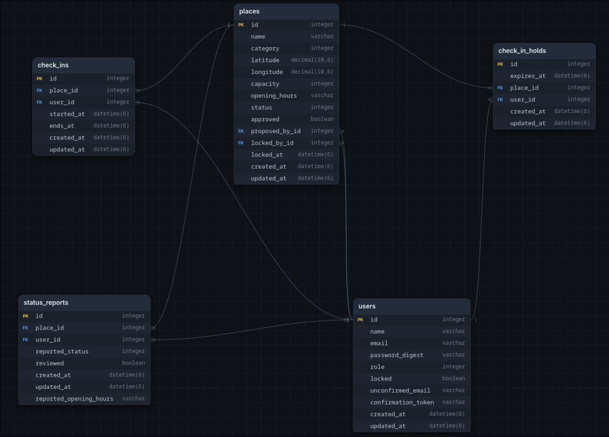

Das Datenmodell beschreibt die zentralen Entitäten der Anwendung:

- Users: Benutzer mit Rollen und Status, inklusive Sperre bei Missbrauch
- Places: Orte mit Kategorie, Standort, Kapazität und Status
- CheckIns: Anmeldungen von Nutzern an einem Ort mit Ablaufzeitpunkt
- StatusReports: Meldungen über Probleme oder Veränderungen an einem Ort
- CheckInHolds: Locked die Tabellen row um Temporär eine Platzt zu reservieren bis der User sich anmeldet.

Die Struktur dient dazu, fachliche Regeln und Rollen eindeutig zu modellieren und gleichzeitig die Multiuser-Fähigkeit der Anwendung zu gewährleisten.

## 7. Breadboards und User-Flows

```text
@Login (sessions#new)
  - E-Mail und Passwort
  - Anmelden (POST sessions#create)
    Success -> @Places
    Invalid credentials -> @Login
  - Registrieren
    -> @Register

@Register (users#new)
  - Name, E-Mail, Passwort
  - Konto erstellen (POST users#create)
    Success -> @Places
    Failure -> @Register

@Places (places#index)
  - Orte suchen und filtern
  - Filter (GET places#index)
    -> @Places
  - Ort auswählen
    -> @Place
  - Neuen Ort vorschlagen
    -> @SuggestPlace

@Place (places#show)
  - Name, Kategorie, Kapazität, Status, freie Plätze
  - Check-in (POST check_ins#create)
    Success -> @Place
    Fully booked -> @Place
  - Status melden
    -> @StatusReport
  - Zurück zur Übersicht
    -> @Places

@SuggestPlace (places#new)
  - Name, Kategorie, Standort, Kapazität, Öffnungszeiten
  - Vorschlag einreichen (POST places#create)
    Success -> @Places
    Failure -> @SuggestPlace

@StatusReport (status_reports#new)
  - Status auswählen: besetzt, geschlossen, verschmutzt
  - Melden (POST status_reports#create)
    Success -> @Place
    Failure -> @StatusReport

@Moderation (moderation/dashboard#show)
  - Offene Vorschläge anzeigen
  - Vorschlag prüfen
    -> @ModerationPlace
  - Ort bearbeiten
    -> @EditPlace
  - Statusmeldung prüfen
    -> @ModerationStatus

@ModerationPlace (moderation/places#show)
  - Vorschlagsdaten und Vorschlagender anzeigen
  - Freigeben (POST moderation/places#approve)
    Success -> @Moderation
  - Ablehnen (POST moderation/places#reject)
    Success -> @Moderation

@EditPlace (moderation/places#edit)
  - Name, Kategorie, Kapazität, Öffnungszeiten
  - Speichern (POST moderation/places#update)
    Success -> @Moderation
    Locked -> @EditPlace
  - Abbrechen
    -> @Moderation

@ModerationStatus (moderation/status_reports#show)
  - Gemeldeter Status, Ort und Zeitpunkt anzeigen
  - Bestätigen (POST moderation/status_reports#approve)
    Success -> @Moderation
  - Verwerfen (POST moderation/status_reports#reject)
    Success -> @Moderation

@Admin (admin/users#index)
  - Alle Nutzer anzeigen
  - Benutzer auswählen
    -> @UserAdmin

@UserAdmin (admin/users#show)
  - Nutzername, E-Mail, Rolle, Status anzeigen
  - Moderator ernennen (POST admin/users#promote)
    Success -> @UserAdmin
  - Rechte entziehen (POST admin/users#demote)
    Success -> @UserAdmin
  - Konto sperren (POST admin/users#lock)
    Success -> @UserAdmin
  - Konto entsperren (POST admin/users#unlock)
    Success -> @UserAdmin
```

Die oben dargestellten Breadboards zeigen die sichtbaren Zustände und wichtigsten Handlungen der Anwendung. Sie definieren keinen kompletten technischen Ablauf, sondern die fachlichen Schritte, die mit den jeweiligen Controller-Actions und Berechtigungen umgesetzt werden müssen.

## 8. Fat-Marker-Sketches der Screens

### 8.1 Registrierung

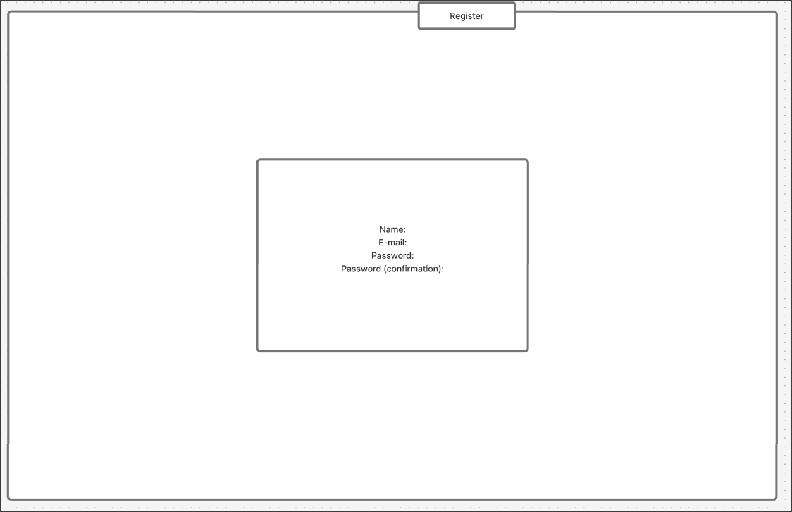

Beschreibung: Der Nutzer kann ein neues Konto anlegen. Dabei werden Name, E-Mail und Passwort erfasst. Die einfache, handgezeichnete Darstellung zeigt die grundsätzliche Interaktion ohne Detailreichtum der fertigen Oberfläche.

### 8.2 Login

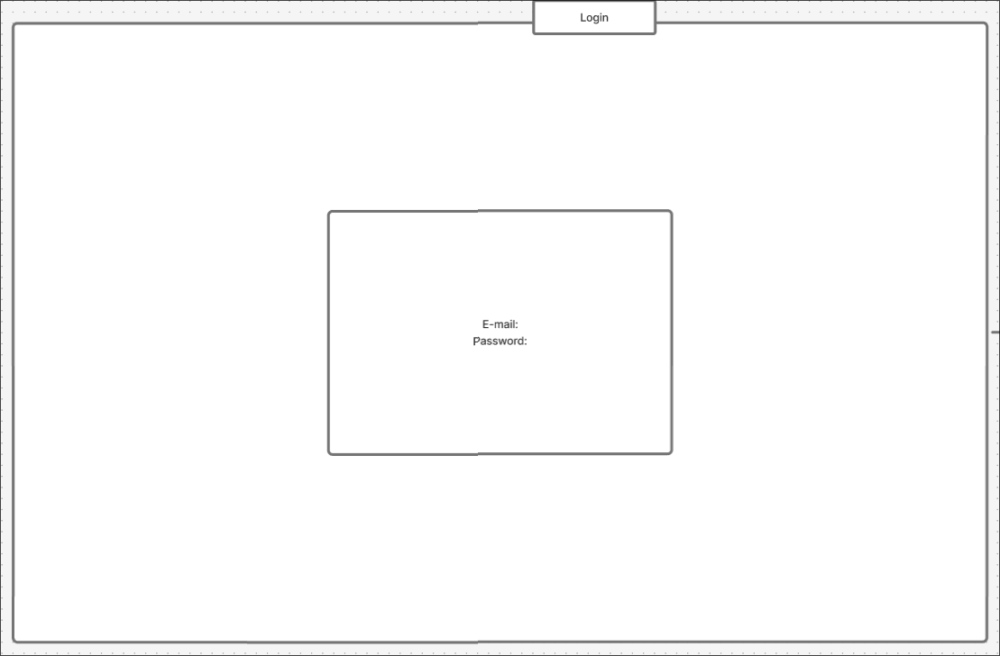

Beschreibung: Die Anmeldung erfolgt mit E-Mail und Passwort. Der Login ist der erste Zugangspunkt in die geschützten Bereiche der Anwendung.

### 8.3 Profil bearbeiten

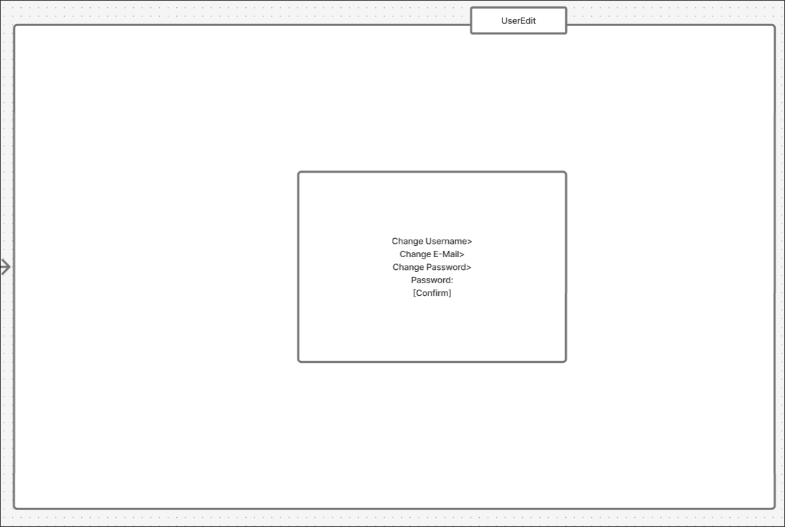

Beschreibung: Das Profil kann nach der Registrierung bearbeitet werden. Dabei können Benutzername, E-Mail und Passwort angepasst werden.

### 8.4 Orte anzeigen

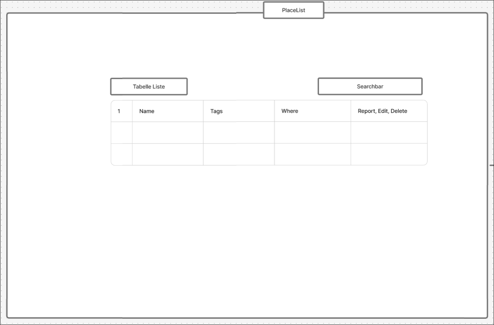

Beschreibung: Die Übersichtsseite stellt alle Ruhe- und Erholungsorte dar. Nutzer können eine Auswahl treffen und weitere Details aufrufen.

### 8.5 Check-in am Ort

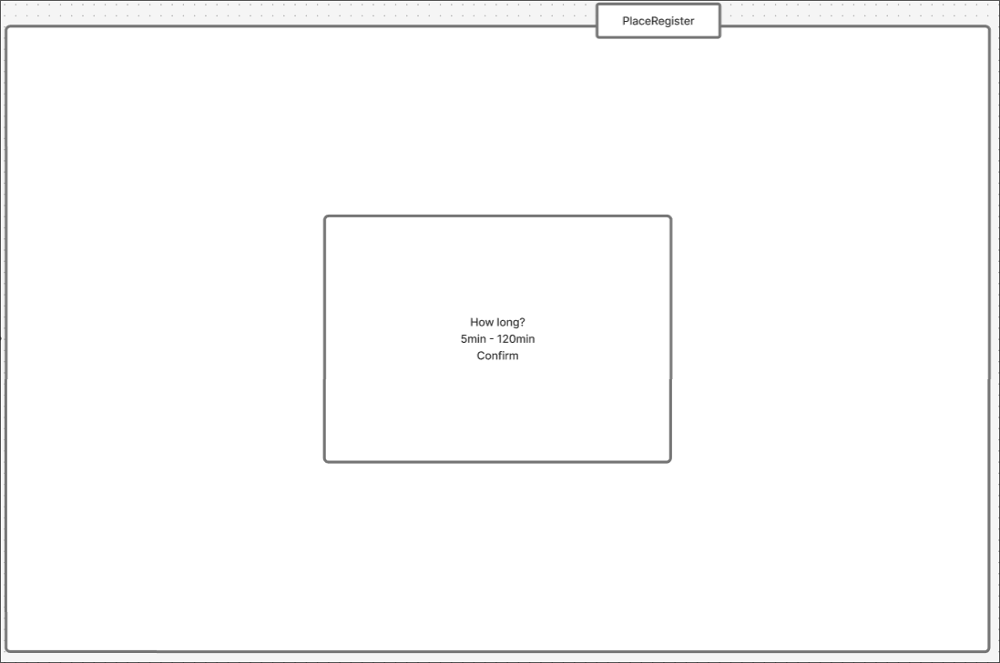

Beschreibung: Der Nutzer meldet sich an einem Ort an und gibt die voraussichtliche Aufenthaltsdauer ein. Die Kapazitätsprüfung ist dabei die fachlich zentrale Regel.

### 8.6 Admin/Moderator-Bereich

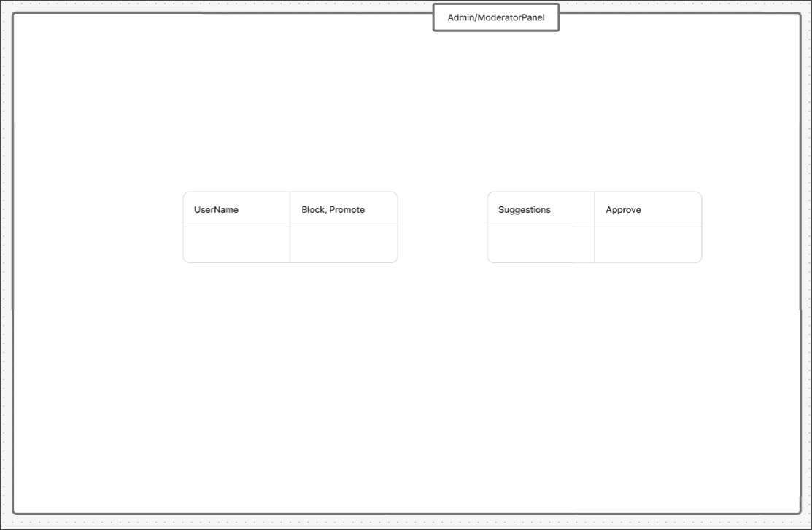

Beschreibung: Im Admin-/Moderatorbereich werden Vorschläge verwaltet, Rechte kontrolliert und Nutzerkonten bearbeitet.

## 9. Technologie-Stack

| Bereich | Technologie |
|---|---|
| Backend-Framework | Ruby on Rails |
| Sprache | Ruby |
| Datenbank | sqlite3 |
| Frontend | Rails Views (ERB) mit Hotwire (Turbo/Stimulus) |
| Authentifizierung | Eigene Session- und Login-Logik |
| Autorisierung | Pundit (rollenbasierte Policies) |
| Testing | Minitest, Request-/System-Tests für Fachregel und Rechte |
| Versionsverwaltung | Git / GitHub |

## 10. Screens und Umsetzung

Die folgenden Screenshots zeigen den aktuellen Stand der Umsetzung und die Nutzeroberfläche der Applikation.

### 10.1 Login

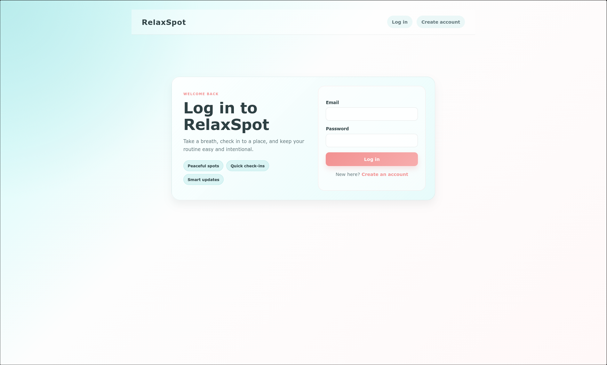

Beschreibung: Die Anmeldung erfolgt mit E-Mail und Passwort. Der Login ist die Grundlage für alle geschützten Bereiche der Applikation.

### 10.2 Registrierung

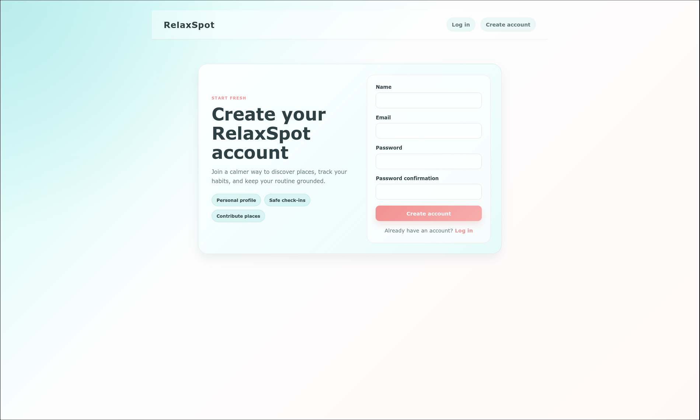

Beschreibung: Ein neuer Nutzer kann ein Konto erstellen. Dabei werden grundlegende Benutzerdaten erhoben und anschließend die Berechtigungen für die Anwendung gesetzt.

### 10.3 Dashboard / Startseite

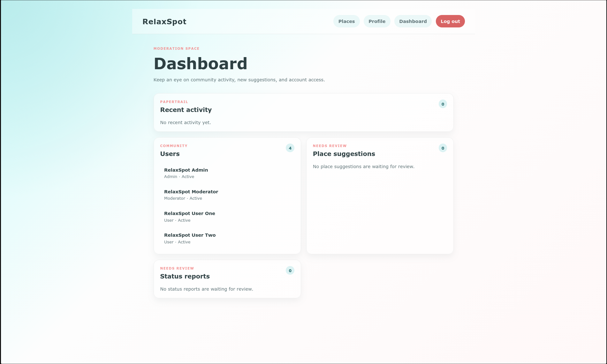

Beschreibung: Die Startseite zeigt die wichtigsten Informationen und den direkten Zugang zu Ortssuche, Profil, Moderation und Verwaltung.

### 10.4 Orte suchen und anzeigen

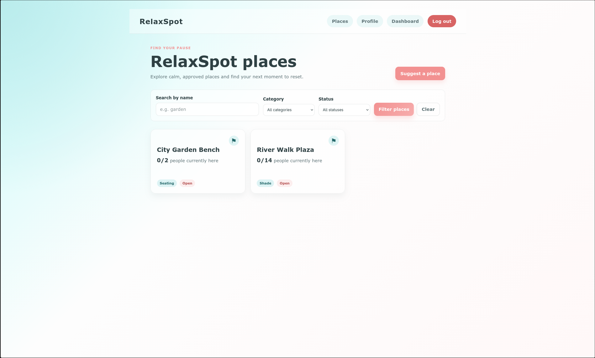

Beschreibung: Die Übersichtsseite listet Orte mit relevanten Informationen wie Name, Kategorie und Verfügbarkeit auf. Nutzer können nach passenden Angeboten suchen und einen Ort genauer öffnen.

### 10.5 Detailansicht eines Ortes

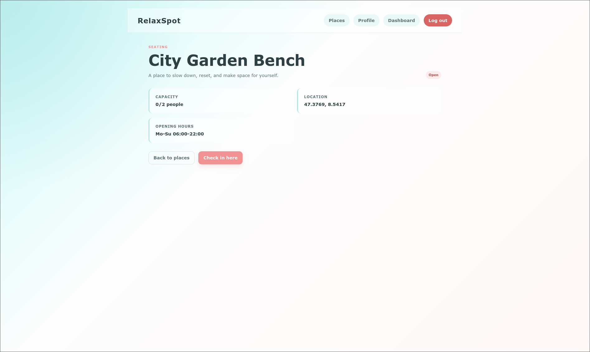

Beschreibung: Auf der Detailseite werden Informationen zum Ort wie Kapazität, Status, Öffnungszeiten und Verfügbarkeit angezeigt. Von hier aus kann der Nutzer eine Anmeldung vornehmen oder einen Status melden.

### 10.6 Check-in / Ort registrieren

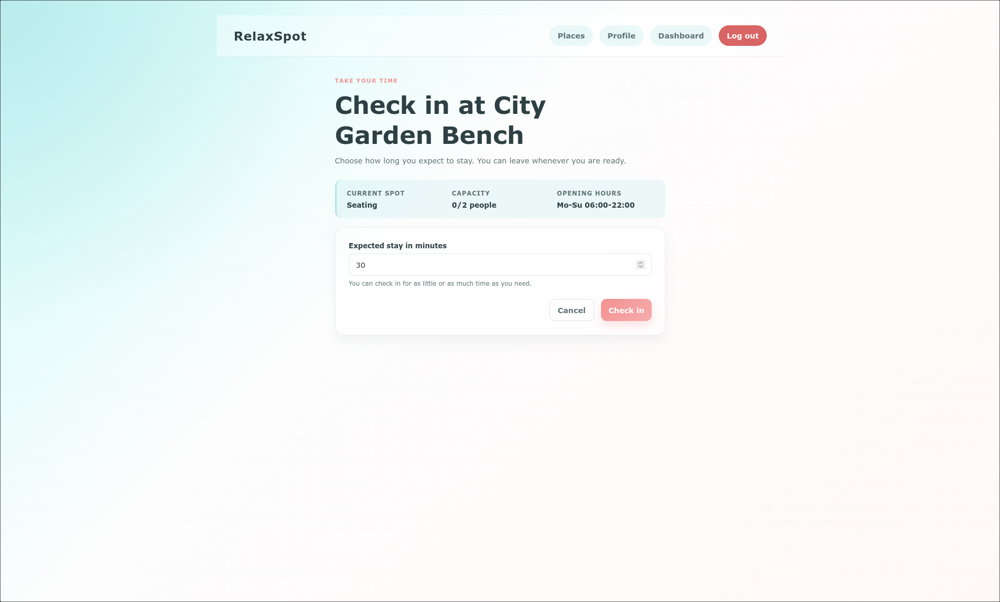

Beschreibung: Der Benutzer kann am Ort angeben, wie lange er voraussichtlich bleibt. Die Kapazitätsprüfung erfolgt dabei auf serverseitiger Ebene.

### 10.7 Profil

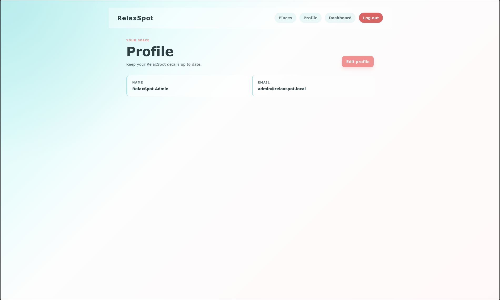

Beschreibung: Das Profil zeigt die Benutzerdaten und die wichtigsten persönlichen Informationen an. Nutzer haben hier die Möglichkeit, ihre Daten zu verwalten.

### 10.8 Profil bearbeiten

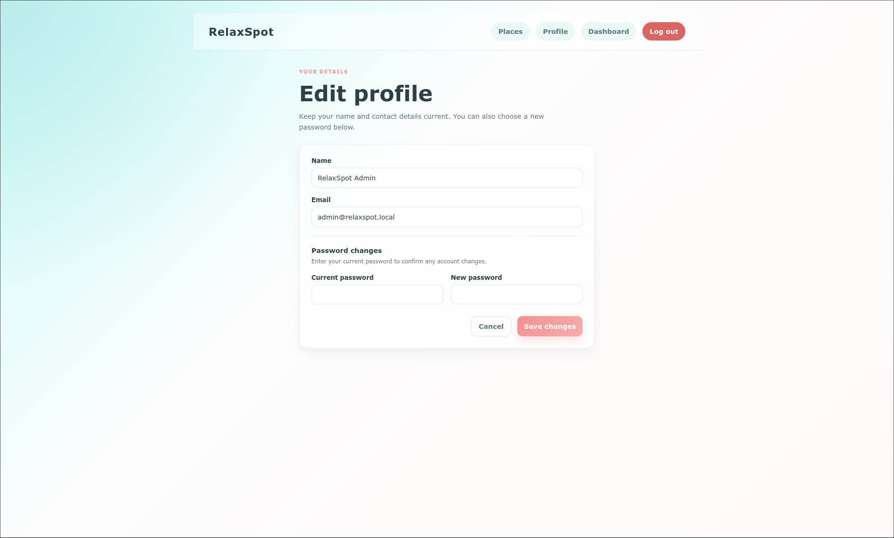

Beschreibung: Über die Profilbearbeitung können E-Mail, Benutzername oder Passwort angepasst werden. Die Eingaben werden validiert und nur mit den passenden Berechtigungen geändert.

## 11. Begründete Abweichungen

Einige fachliche Details wurden aus Umsetzungs- und Prüfungsgründen konkretisiert oder vereinfacht:

- Die Darstellung der Kapazitätsprüfung wird in der Oberfläche als klare Meldung statt als komplexe technische Transaktionsdarstellung gezeigt.
- Die Statusmeldungen wurden als einfache, verständliche Interaktion modelliert, ohne ein ausuferndes Workflow-System für alle möglichen Exceptions aufzubauen.
- Die Moderationsansicht konzentriert sich auf die wichtigsten Vorgänge: Vorschläge prüfen, Orte bearbeiten und Statusmeldungen verwalten.

## 12. Offene Punkte

Die bisherige Umsetzung deckt die Kernfunktionalität der ersten Iteration ab. Einige Bereiche sind noch offen und sollen in einer weiteren Entwicklungsphase vertieft werden:

- automatische Beendigung oder Bereinigung abgelaufener Check-ins
- weiter optimierte Filter- und Sortierlogik für grössere Datenmengen
- zusätzliche Randfalltests bei gleichzeitigen Zugriffen und unvollständigen Eingaben
- Ausbau der Benutzerfeedbacks bei Konflikten und fehlenden Berechtigungen

Diese Punkte sind keine negativen Mängel, sondern logische Erweiterungen der ersten MVP-Iteration und damit fachlich sinnvoll im Projektverlauf.

## 13. Prüfung der Anforderungen und Ergebnisse

| ID | Anforderung | Prüfung | Ergebnis |
|---|---|---|---|
| A1 | Registrierung und Login | Erfolgreiche Anmeldung mit Testdaten | Erfüllt |
| A2 | Orte suchen und filtern | Prüfung über die Platzliste und Filterlogik | Erfüllt |
| A3 | Check-in mit Kapazitätsprüfung | Test des letzten freien Platzes und Überlauf | Erfüllt |
| A4 | Vorschlag neuer Orte | Einreichen und Freigabe durch Moderator | Erfüllt |
| A5 | Statusmeldung | Erstellung und Anzeige des Status | Erfüllt |
| A6 | Rollen- und Berechtigungslogik | Prüfung erlaubter und verweigerter Zugriffe | Erfüllt |
| A7 | Locking bei Bearbeitung | Versuch zweier paralleler Bearbeitungen | Erfüllt |
| A8 | Datenkonsistenz | Mehrfache gleichzeitige Check-ins | Erfüllt |

Die Prüfung erfolgte fachlich anhand der definierten Kernfunktionalität, des Rollenmodells und der Multiuser-Anforderungen. Die zentralen Regeln wurden auf reale Interaktionen und parallel laufende Zugriffe hin überprüft.

## 14. Fazit

RelaxSpot erfüllt die grundlegenden Anforderungen einer Multiuser-Applikation im Bereich der Erholungs- und Pausenorte. Die Kernfunktion – das Finden eines Ortes und die sichere, kapazitätsgerechte Anmeldung – bildet den fachlichen Kern der Umsetzung. Die Dokumentation zeigt die motivierende Problemstellung, die fachlichen Regeln, die Rollenstruktur und den aktuellen technischen Stand der Anwendung.

Damit ist das Projekt nicht nur als fachlich sinnvolle Anwendung konzipiert, sondern auch als Multiuser- und Rollenmodell mit realen Sicherheits- und Konsistenzanforderungen umgesetzt. Die Projektarbeit bildet damit eine solide Grundlage für weitere Erweiterungen und eine spätere Professionalisierung der Anwendung.