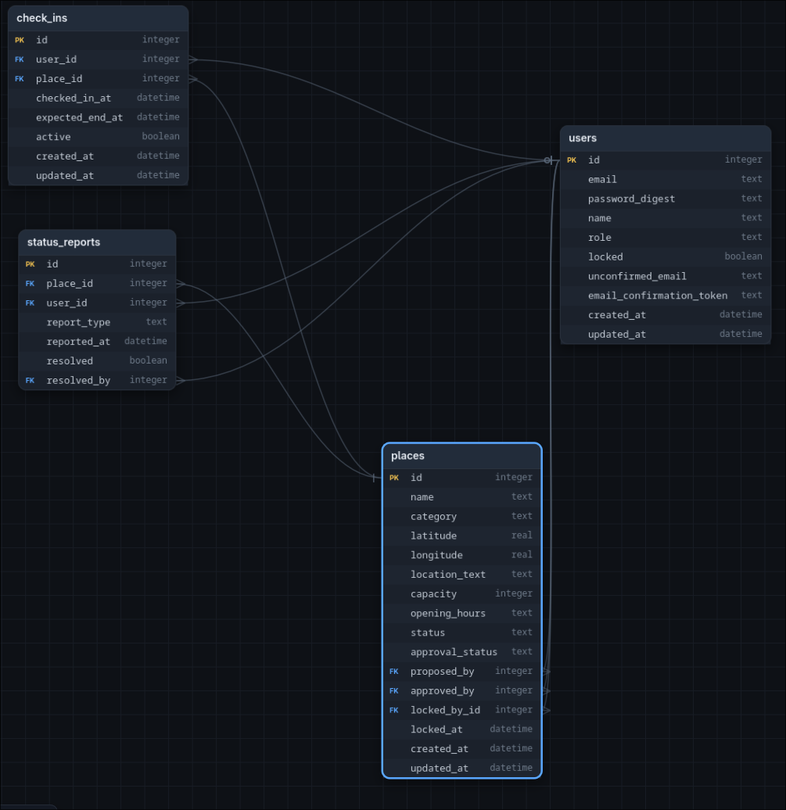

# Projektantrag: RelaxSpot

**Modul**: 223 - Multiuser-Applikation
**Autor**: Yoshi Gyger
**Datum**: 18.09.2026
**Schulklasse**: INA24C

## 1. Problemstellung

In Pausen im Berufsalltag oder im öffentlichen Raum (z. B. Bahnhof, Innenstadt, Betriebsgelände) fehlt es Nutzenden oft an schnellem, verlässlichem Wissen darüber, wo sich ein passender Ort zum kurzen Entspannen befindet, etwa ein schattiger Sitzplatz, eine Raucherzone oder eine öffentliche Toilette. Bestehende Informationsquellen sind meist unvollständig, veraltet oder auf eine einzelne Kategorie beschränkt (z. B. nur Raucherzonen oder nur Toiletten).

Zusätzlich sind viele dieser Orte in ihrer Kapazität begrenzt (z. B. eine kleine Sitzbank, eine Raucherkabine mit Platz für zwei Personen). Ohne Echtzeit-Information darüber, ob ein Ort gerade belegt ist, kommt es regelmässig zu unnötigen Wegen, Wartezeiten und Frustration, besonders in kurzen Pausen, in denen Zeit ein knappes Gut ist.

Diese Problemstellung betrifft praktisch jeden, der im Alltag unterwegs ist: Lernende und Berufstätige in Pausen, Pendler, Besuchende von Innenstädten. Sie tritt mehrmals täglich auf, ist bislang aber technisch nicht zufriedenstellend gelöst, da bestehende Lösungen entweder nur einzelne Ortstypen abdecken oder keine Kapazitätsfunktion bieten.

## 2. Projekt

- **Domäne**: Community-basiertes Verzeichnis für öffentliche Erholungs- und Pausenorte mit Kapazitätsverwaltung
- **Name der Applikation**: RelaxSpot
- **Vision**: RelaxSpot ermöglicht es Menschen, in ihrer Umgebung schnell einen passenden Ort zum Entspannen zu finden, Sitzplätze, Raucherbereiche, schattige Plätze oder Toiletten, und sich dort bei begrenzter Kapazität für die geplante Aufenthaltsdauer anzumelden. Die Datenqualität wird durch eine Community getragen, die neue Orte vorschlägt und Änderungen meldet, kuratiert durch vertrauenswürdige Moderatoren.

### Projektplanung: 1. MVP-Iteration

Die wichtigste domänenspezifische funktionale Anforderung der ersten Iteration ist die Anmeldung an einem Ort inklusive Kapazitätsprüfung: Ein Nutzer gibt an, dass er sich jetzt an einem Ort befindet und wie lange er voraussichtlich dort bleibt. Der Ort gilt für diese Zeitspanne als (teil-)belegt. Ist die Kapazität erreicht, wird die Anmeldung abgelehnt. Es handelt sich dabei um eine reine Anwesenheits-Anmeldung, keine Vorab-Reservierung für einen zukünftigen Zeitpunkt.

Dafür notwendige Multi-User-Aspekte:

- Gleichzeitige Anmeldeanfragen mehrerer Nutzer für denselben Ort müssen korrekt und konsistent aufgelöst werden (kein Overbooking über die Kapazität hinaus).
- Rollenbasierte Rechteprüfung (Nutzer, Moderator, Admin) muss bereits für die Kernfunktion und die Ortsverwaltung greifen.
- Ein Edit-Lock verhindert, dass zwei Moderatoren/Admins gleichzeitig denselben Ort widersprüchlich bearbeiten.

## 3. Anforderungsanalyse

### 3.1 Funktionale Anforderungen (priorisiert)

1. Nutzer können sich registrieren und einloggen
2. Nutzer können öffentliche Orte nach Kategorie (Sitzplatz, Raucherbereich, Schattenplatz, Toilette) und Standort suchen/filtern
3. Nutzer können sich an einem Ort anmelden und angeben, wie lange sie voraussichtlich dort bleiben; die Anmeldung wird nur bestätigt, wenn die Kapazität des Ortes nicht überschritten wird
4. Nutzer können neue Orte vorschlagen (Name, Kategorie, Standort, Kapazität); der Vorschlag ist bis zur Freigabe nicht öffentlich sichtbar
5. Nutzer können den aktuellen Status eines Ortes melden (z. B. „besetzt“, „geschlossen“, „verschmutzt“)
6. Moderatoren können vorgeschlagene Orte prüfen, freigeben oder ablehnen
7. Moderatoren können Ortsdetails korrigieren (Öffnungszeiten, Kapazität, Kategorie); während der Bearbeitung ist der Ort für andere Moderatoren/Admins gesperrt
8. Admin kann Moderatorenrechte vergeben und entziehen sowie Nutzerkonten bei Missbrauch sperren

### 3.2 Qualitätsattribute (nicht-funktionale Anforderungen, priorisiert)

1. **Datenkonsistenz**: Bei gleichzeitigen Anmeldungen mehrerer Nutzer an einem Ort mit Restkapazität von einem Platz wird genau eine Anmeldung bestätigt, alle weiteren werden mit einer verständlichen Fehlermeldung abgelehnt.
2. **Performance**: Die Umgebungssuche zeigt bei 2'000 erfassten Orten und 20 gleichzeitigen Suchanfragen die gefilterten Ergebnisse innerhalb von 2 Sekunden an.
3. **Nachvollziehbarkeit (Integrität der Bearbeitung)**: Während ein Moderator einen Ort bearbeitet (Edit-Lock aktiv), erhält ein zweiter Moderator beim Versuch, denselben Ort zu bearbeiten, innerhalb von 1 Sekunde eine Meldung, dass der Ort aktuell gesperrt ist, inklusive Angabe, wer ihn bearbeitet.
4. **Aktualität**: Eine Statusmeldung (z. B. „besetzt“) ist spätestens 5 Sekunden nach dem Melden für alle anderen Nutzer, die den Ort abrufen, sichtbar.
5. **Zugriffskontrolle**: Aktionen ausserhalb der Rollenberechtigung (z. B. Ortsfreigabe durch einfache Nutzer) werden serverseitig in 100% der Testfälle abgelehnt und mit HTTP-Status 403 beantwortet.

### 3.3 Benutzerrollen

| Rolle | Berechtigungen |
|---|---|
| Nutzer | Orte suchen/filtern, sich an einem Ort anmelden (inkl. voraussichtlicher Aufenthaltsdauer), neue Orte vorschlagen, Status melden |
| Moderator | Alle Nutzer-Rechte, zusätzlich: vorgeschlagene Orte freigeben/ablehnen, Ortsdetails bearbeiten (mit Edit-Lock), widersprüchliche Statusmeldungen auflösen |
| Admin | Alle Moderator-Rechte, zusätzlich: Moderatoren ernennen/entziehen, Nutzerkonten sperren, globale Systemeinstellungen (Kategorien, Kapazitätsregeln) verwalten |

### 3.4 Locking und Transaktionen

**Kapazitätskonflikt (zentrale Fachregel).**
Die Anmeldung an einem Ort ist die zentrale Fachregel von RelaxSpot: Ein Ort hat eine feste Kapazität (z. B. 2 Plätze in einer Raucherkabine). Meldet sich ein Nutzer an, wird geprüft, wie viele aktive Anmeldungen (Anmeldungen mit noch nicht abgelaufener voraussichtlicher Aufenthaltsdauer) für diesen Ort aktuell bestehen. Nur wenn `aktive_anmeldungen < kapazität`, wird die neue Anmeldung erstellt.

Da mehrere Nutzer gleichzeitig auf denselben Ort zugreifen können (z. B. der letzte freie Platz), muss diese Prüfung und das Erstellen der Anmeldung als eine atomare Datenbanktransaktion ausgeführt werden. Dafür wird pessimistisches Locking eingesetzt (`SELECT ... FOR UPDATE` auf die Ortszeile bzw. eine Datenbank-Constraint/Unique-Index-Lösung), damit zwei parallele Transaktionen nicht beide auf Basis desselben veralteten Zählerstands eine Anmeldung erzeugen können (kein Overbooking). Die zweite, zeitlich spätere Transaktion erhält nach Auflösung des Locks eine aktualisierte Zählung und wird bei Kapazitätsüberschreitung mit einer Fehlermeldung abgelehnt.

**Bearbeitungskonflikt (Edit-Lock).**
Wenn ein Moderator die Detailseite eines Ortes zur Bearbeitung öffnet, wird für diesen Ort ein Edit-Lock gesetzt (z. B. Zeitstempel + Referenz auf den bearbeitenden Moderator in der Datenbank). Versucht ein zweiter Moderator oder Admin währenddessen denselben Ort zu bearbeiten, wird der Zugriff verweigert und eine Meldung mit Name des aktuell bearbeitenden Moderators sowie Sperrzeitpunkt angezeigt. Der Lock wird beim Speichern, beim Abbrechen der Bearbeitung oder automatisch nach einem Timeout (z. B. 5 Minuten Inaktivität) wieder freigegeben, um verwaiste Locks zu verhindern.

### 3.5 ERM (Entity-Relationship-Modell)

**users**: In der User tabellen werden die Daten fesgelegt sowie ihre Rolle. Die Locked-spallte ist für das blockieren eines Users dort. (Admin kann user blockieren)

**places**: Diese Tabelle ist zuständig für alle Daten der Ruheplätze. Es gibt an wo (long,lat), was (category) und wie (status, opening hours und capacity) diese sind. Die proposed_by fk ist für den User welche einen Vorschlag gemacht hat. Locked_by_id, locked spezifische felder bei dem öffnen eines Modals zum bearbeiten.

**check_ins**: Für die anmeldung eines Platzes.

**status_report**: Für die bearbeitungs Antrag von Usern. Heisst falls ein Platzt nicht mehr verfügbar ist, andere Öffnungszeiten kann dies gemeldet werden.

### 3.6 Breadboards der User-Flows

#### 3.6.1 Ort suchen & Check-in durchführen (Kernfunktion, Rolle: Nutzer)

@Login (sessions#new)
E-Mail, Passwort -> Einloggen (POST sessions#create)
Success -> @Ortsliste
Failure -> @Login
Registrieren -> @Registrierung

@Registrierung (users#new)
Name, E-Mail, Passwort -> Konto erstellen (POST users#create)
Success -> @Ortsliste
Failure -> @Registrierung

@Ortsliste (places#index)
Filter: Kategorie
Filter: Breitengrad, Längengrad, Radius (km) -> Suchen (GET places#index)
Ort in Liste anzeigen: Name, Kategorie, Breitengrad, Längengrad, freie Plätze
Ort auswählen -> @Ortsdetail
Neuen Ort vorschlagen -> @OrtVorschlagen

@Ortsdetail (places#show)
Name, Kategorie, Breitengrad, Längengrad, Öffnungszeiten, Kapazität, Status, freie Plätze anzeigen
Hier anmelden -> @CheckInFormular
Status melden -> @StatusMeldungFormular
Zurück zur Liste -> @Ortsliste

@CheckInFormular (check_ins#new)
Voraussichtliche Aufenthaltsdauer (Minuten) -> Bestätigen (POST check_ins#create)
Success -> @CheckInBestätigung
Failure -> @Ortsdetail (Fehlermeldung: Ort ist aktuell voll)

@CheckInBestätigung (check_ins#show)
Angemeldet bis HH:MM anzeigen
Fertig -> @Ortsliste

#### 3.6.2 Ort vorschlagen & Status melden (Rolle: Nutzer)

@OrtVorschlagen (places#new)
Name, Kategorie, Breitengrad, Längengrad, Kapazität, Öffnungszeiten -> Vorschlag einreichen (POST places#create)
Success -> @Ortsliste (Hinweis: Vorschlag eingereicht, wartet auf Freigabe)
Failure -> @OrtVorschlagen

@StatusMeldungFormular (status_reports#new)
Status wählen: besetzt, geschlossen, verschmutzt -> Melden (POST status_reports#create)
Success -> @Ortsdetail (Hinweis: Status gemeldet)
Failure -> @StatusMeldungFormular

#### 3.6.3 Moderation & Edit-Lock (Rolle: Moderator/Admin)

@ModeratorDashboard (moderation/dashboards#show)
Offene Ort-Vorschläge anzeigen
Vorschlag öffnen -> @VorschlagPruefung
Alle Orte verwalten anzeigen
Ort bearbeiten -> @OrtBearbeiten
Offene Statusmeldungen anzeigen
Meldung öffnen -> @StatusmeldungPruefung

@VorschlagPruefung (moderation/places#show)
Eingereichte Ortsdaten, Koordinaten, vorgeschlagen von (Nutzername) anzeigen
Freigeben (POST moderation/places#approve) -> @ModeratorDashboard (Ort wird öffentlich sichtbar)
Ablehnen, Begründung -> (POST moderation/places#reject) -> @ModeratorDashboard

@OrtBearbeiten (moderation/places#edit)
Failure -> @ModeratorDashboard (Ort ist gesperrt von <Moderator>, seit HH:MM)
Name, Kategorie, Breitengrad, Längengrad, Kapazität, Öffnungszeiten -> Speichern (POST moderation/places#update)
Success -> @ModeratorDashboard (Edit-Lock wird freigegeben)
Failure -> @OrtBearbeiten
Abbrechen (POST moderation/places#unlock) -> @ModeratorDashboard (Edit-Lock wird freigegeben)

@StatusmeldungPruefung (moderation/status_reports#show)
Gemeldeter Status, Ort, Zeitpunkt anzeigen
Bestätigen (POST moderation/status_reports#approve) -> @ModeratorDashboard (Ortsstatus aktualisiert)
Verwerfen (POST moderation/status_reports#reject) -> @ModeratorDashboard

#### 3.6.4 Admin – Rollen- und Kontoverwaltung (Rolle: Admin)

@AdminDashboard (admin/users#index)
Alle Nutzer anzeigen: Nutzername, E-Mail, Rolle, Locked-Status
Nutzer auswählen -> @NutzerdetailAdmin

@NutzerdetailAdmin (admin/users#show)
Nutzername, E-Mail, aktuelle Rolle, Locked-Status anzeigen
Zu Moderator ernennen (POST admin/users#promote) -> @NutzerdetailAdmin (Rolle aktualisiert)
Moderator-Rechte entziehen (POST admin/users#demote) -> @NutzerdetailAdmin (Rolle aktualisiert)
Konto sperren (POST admin/users#lock) -> @NutzerdetailAdmin (Locked aktualisiert)
Konto entsperren (POST admin/users#unlock) -> @NutzerdetailAdmin (Locked aktualisiert)
Zurück -> @AdminDashboard

### 3.7 Fat-Marker-Sketches der Screens

Der User sollte sich registrieren können, sein Name, E-mail und Passwort wie Passwort bestätigung ist gebraucht.

User können sich mit E-Mail und Passwort anmelden können.

User können ihre E-Mail, Password und Username ändern.

Liste von allen Ruheörter, User können reporten, Moderatoren Editieren und Admin Löschen. Auf das draufklicken kann man sich für ein Ort anmelden.

User können sich für einen Ort anmelden und sagen wie lange sie dort sind.

In der Admin/Moderator Panel können Admin user blocke und Admin/Moderator Vorschläge akzeptieren.

## 4. Technologie-Stack

| Bereich | Technologie |
|---|---|
| Backend-Framework | Ruby on Rails |
| Sprache | Ruby |
| Datenbank | sqlite3 |
| Frontend | Rails Views (ERB) mit Hotwire (Turbo/Stimulus) |
| Authentifizierung | Einfach selber |
| Autorisierung | Pundit (rollenbasierte Policies) |
| Testing | Minitest bzw. RSpec, System-/Request-Tests für Kapazitätsregel und Zugriffsrechte |
| Versionsverwaltung | Git / GitHub |

**Hinweis zur Kernfunktion:** Nutzer melden sich an einem Ort an und geben dabei ihre voraussichtliche Aufenthaltsdauer an. Es handelt sich ausdrücklich nicht um eine Vorab-Reservierung für einen zukünftigen Zeitpunkt, sondern um eine Anwesenheitsmeldung „ich bin jetzt hier und bleibe ca. X Minuten“, gegen die die Kapazität des Ortes geprüft wird.
